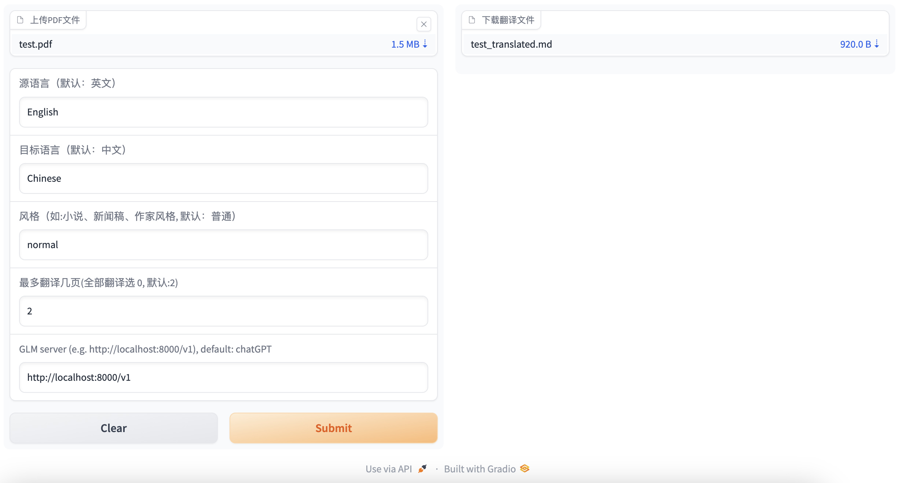
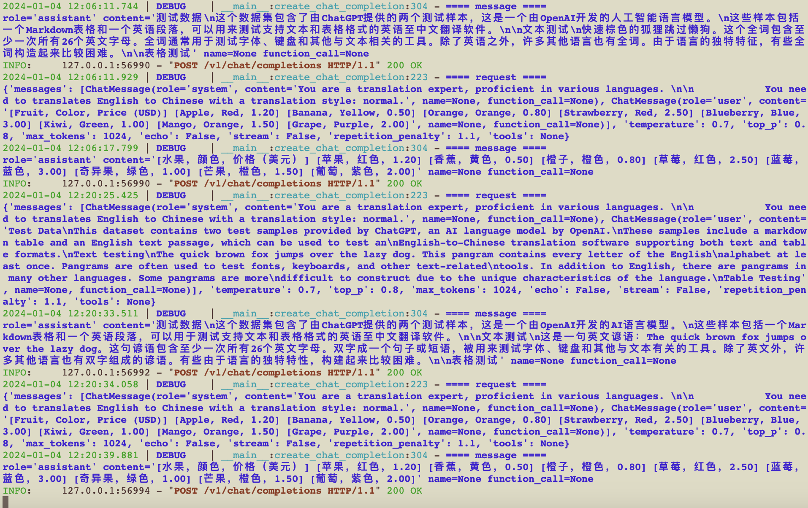

本程序提供了 gradio UI, 用户可以通过 UI 上传待翻译的 pdf 文件:
并且可选择翻译为哪种语言.

文件上传后, 可通过 UI 下载翻译完的文件.

本版本允许用户配置翻译语言的风格: 小说、新闻稿、作家风格

运行一下命令启动程序:
```bash
python gradio_server.py
```
# ChatGLM
你可以使用 GLM 模型做翻译. 你需要先运行 [openai_api.py](https://github.com/THUDM/ChatGLM3/blob/main/openai_api_demo/openai_api.py) 
在本地或者远程服务器上. 并且在 UI 界面上, 输入 GLM API 的地址. 如下所示:



在 GLM server 端, 你可以看到 GLM 模型的输出:

